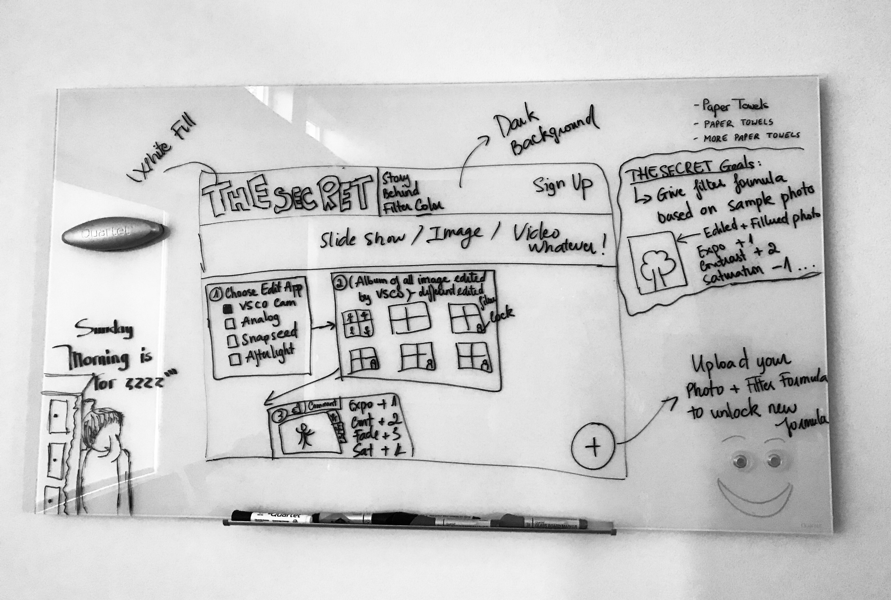

# The Secret
> Creator: Phuong Le
>  |  Seattle, WA
>  |  March,2019 - Present

A question is
**How can these instagrammers can make it happen?**

Click [me](https://lekhacminhphuong.github.io/The-Secret/) to visit _The Secret_

### Current issues

- In recent years, it is undeniable that Instagram has witnessed significant growth in popularity. An increasing number of people use Instagram social networks every day to share their photos and build up their own Instagram feed.

- In order to gain likes, profile visits, and new followers, Instagram users have begun considering how their Instagram theme catch other people's eyes.

- Therefore, questions are listed: How to make my Instagram feed theme beautiful, flow and consistent? How to get my unique filter based on some basic existing filters?

- Although filter applications are popularized and developed, there are only several basic filters are for free and other beautiful filters are for purchasing. Therefore, in order to obtain these ones without purchasing, users need to know and follow some extra steps in editing the exposure, contrast, saturation,… of the photo.

- After doing some research, there are a significant number of Instagram accounts, sharing a huge number of posts that provide the theme option and filter formula. However, these posts are not organized which made users spend a lot of time to discover their themes.

### Why _The Secret_
- The name of this web application is The Secret which means that the application will give you secret tips to obtain your secret and unique Instagram theme.

- The Secret is built up the idea and designed by one of Instagram lovers. Therefore, it is obvious that Instagram users are the most prominent group of users that the web application would like to attack.

- So, what our application can do for their Instagram?

### Project Summary
- Developed a website which supports users in choosing their Instagram themes and provide filter formulas on how to use app and edit your photos to obtain the chosen theme.

- The web also allows users to search photos by given categories (data from [unsplash](https://source.unsplash.com/">https://source.unsplash.com))

- Utilized HTML, CSS, and JavaScript to build an user interface.

### The Secret's Paper prototype

